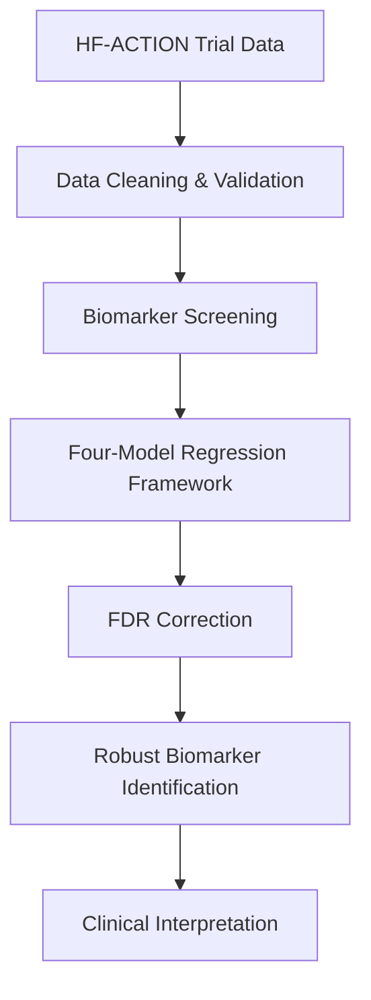

# HF-ACTION Functional Reserve Analysis

[](LICENSE)
[](https://www.r-project.org/)
[](https://biolincc.nhlbi.nih.gov/)

Biomarker analysis of **functional reserve** in patients with heart failure with
reduced ejection fraction (HFrEF), using data from the **HF-ACTION** randomized
clinical trial.

This repository accompanies a completed master's project in the Department of
Biostatistics & Bioinformatics at Duke University.

---

## Overview

This project evaluates whether a panel of **32 baseline protein biomarkers** is
associated with **functional reserve** — baseline cardiopulmonary exercise capacity
(peak VO₂) — in HFrEF, using a prespecified four-model robustness framework.

> **Scope:** This repository covers the completed analysis of functional reserve.
> Two extensions were scoped but are outside the delivered work — see
> [Planned extensions](#planned-extensions).

---

## Key Skills Demonstrated

- Clinical Trial Data Analysis
- Biomarker Discovery
- Multiple Linear Regression
- False Discovery Rate (FDR) Correction
- Reproducible Research in R
- Statistical Analysis Plan (SAP) Development
- Clinical Data Cleaning and Validation
- Publication-Style Statistical Reporting

---
## Analysis Workflow


 ---

## Methods

**Sample.** HFrEF participants from the HF-ACTION biomarker substudy. The analytic
sample for regression models is *n* = 263 (from *n* = 300 with biomarker data;
exclusions driven primarily by missing covariate data). The correlation structure is
described on the full biomarker-complete cohort (*n* = 300).

**Aim 1 — functional reserve.** Each z-scored biomarker is related to peak VO₂ under a
prespecified four-model framework crossing adjustment (unadjusted vs. adjusted for
sex, BMI, BUN, and KCCQ symptom burden) with outcome scale (original vs.
log-transformed). Multiplicity is controlled with the Benjamini–Hochberg procedure
(FDR *q* < 0.10). A biomarker is considered **robust** when it shows (1) direction
consistency across all four model specifications **and** (2) *q* < 0.10 in both
adjusted models.

**Headline result.** 13 of 32 biomarkers met both robustness criteria; associations
with peak VO₂ were predominantly inverse.

---
## Results Snapshot

- 32 baseline biomarkers evaluated
- 263 participants included in adjusted analyses
- 13 biomarkers met predefined robustness criteria
- Associations with functional reserve were predominantly inverse
- Findings were consistent across all four model specifications

---

## Planned extensions

The functional reserve analysis was designed to support two further directions, which
are **not part of this repository's completed work**:

- **Functional recovery** — predicting change in peak VO₂ at 3 months from baseline
  biomarkers using LASSO penalized regression.
- **Functional resilience** — a residual-based analysis testing whether biomarkers add
  predictive value beyond clinical measures.

These are noted to document the project's intended scope, not as delivered results.

---

## Repository structure

```
.
├── R/                  # Analysis scripts and R Markdown notebooks (Aim 1)
├── data/               # Data access instructions only (no data committed)
├── output/
│   ├── figures/        # Generated figures
│   └── tables/         # Generated publication tables
└── docs/               # Statistical analysis plan, report
```

---

## Data availability

The HF-ACTION trial data are **not redistributed in this repository.** They are
available to qualified investigators through the **NHLBI Biologic Specimen and Data
Repository Information Coordinating Center (BioLINCC)** under a Data Use Agreement.

- Request access: https://biolincc.nhlbi.nih.gov/studies/hf_action/

To reproduce the analysis, obtain the data through BioLINCC and place the files in a
local `data/` directory matching the paths referenced in `R/01_data_prep.R`. The
`.gitignore` is configured to prevent data files from being committed.

---

## Reproducibility

Analyses were conducted in **R** using R Markdown.

Core packages:

| Package | Use |
|---------|-----|
| `gtsummary`, `gt` | Descriptive and publication tables |
| `readxl` | Reading source spreadsheets |
| `tidyverse` | Data manipulation and plotting |

```r
# Install dependencies
install.packages(c("tidyverse", "gtsummary", "gt", "readxl"))
```

Run the scripts in numerical order. Set the working directory to the repository root
before sourcing.

---

## Citation

If you reference this work, please cite it using the metadata in
[`CITATION.cff`](CITATION.cff).

---

## Author

**Patrick Bautista**
Master's candidate, Biostatistics & Bioinformatics, Duke University

*Advisor:* Marissa Ashner, PhD
*Committee:* Sarah Peskoe, PhD · Leanna Ross, PhD

---

## License

Code in this repository is released under the [MIT License](LICENSE). The license
applies to the analysis code only and does **not** extend to the HF-ACTION data, which
remain governed by the NHLBI BioLINCC Data Use Agreement.

---

## Acknowledgments

This research uses data from the HF-ACTION trial, supported by the National Heart, Lung,
and Blood Institute (NHLBI) and obtained through NHLBI BioLINCC. The views expressed
here are the author's own and do not reflect those of the NHLBI.
